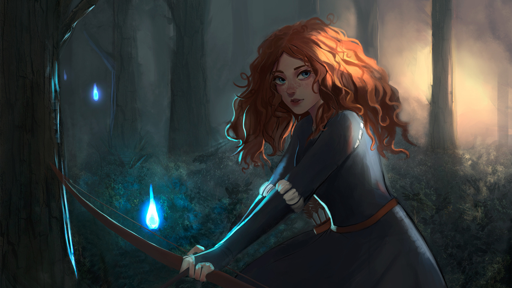

# Safe-Kids
#### Kids Movies App – a safe and fun cartoon app for children under supervision of digital Egyptian pioneers intiative.

Team Members
--------------------------------------------------------------------------------------------------------------------------------------------------------------------
- Basant Mohamed Shaban
- Basmala Nasser Mohamed
- Dareen Hasan Ali
- Roaa Abdelghany Abdo
- Salsabil Ahmed Hussien

Project Overview
--------------------------------------------------------------------------------------------------------------------------------------------------------------------
The Kids Movies App is created to give children a safe and fun place to watch animated movies. It provides a curated collection of movies that are suitable for kids, with a simple and friendly design. The project will be developed using Android Studio for mobile development .

Project Objectives
--------------------------------------------------------------------------------------------------------------------------------------------------------------------
- Deliver a safe and trusted collection of kids’ movies and cartoons.
- Design a fun, colorful, and easy-to-use interface made especially for children.
- Ensure a secure and enjoyable viewing experience, free from irrelevant content and fully suitable for young ages.
  
Project Scope
--------------------------------------------------------------------------------------------------------------------------------------------------------------------
- Mobile Development: Develop an Android mobile application using Android Studio.
- Database & Content: Implement a database solution to store and manage kids’ movies with details (title, image, description).
- UI/UX Design: Build a child-friendly interface that is fun, colorful, and easy to use.
- Testing & Quality Assurance: Test the app to ensure it is safe, reliable, and user-friendly.
  
Project Plan
--------------------------------------------------------------------------------------------------------------------------------------------------------------------
### Week 1: Project Setup & UI Design
#### Tasks:

•	 Initialize the project in Android Studio.

•	 Set up a new repository on GitHub for version control.

•	 Design wireframes for the main screens (home screen, movie details).

•	 Build a static version of the home screen with a fun and colorful design.

#### Deliverables:

•	 Android Studio project initialized and pushed to GitHub.

•	 Wireframes showing app screens and navigation flow.

•	 Static home screen implemented.

### Week 2: Database Integration & Dynamic Display
#### Tasks:
•	 Connect the app to a database solution (Firebase or APIs).

•	 Add a collection of kids’ movies with details (title, description, image).

•	 Fetch data and display movies dynamically on the home screen.

#### Deliverables:
•	 Functional database connection.

•	  Movies displayed dynamically in the app.

### Week 3: Navigation & Movie Details
#### Tasks:
•	 Implement navigation between the home screen and the movie detail screen.

•	 Build a movie detail screen to display title, description, and image.

•	 Pass data correctly between screens to show the selected movie.

•	 Write unit tests for basic logic and data handling.

#### Deliverables:
•	 Smooth navigation between screens.

•	 Functional movie detail screen.

•	 Passing unit tests for business logic.

### Week 4: Final Polish & Documentation
#### Tasks:
•	 Add a search bar to allow users to find movies by title.

•	 Apply security best practices (e.g., handling API keys safely if APIs are used).

•	 Refine the UI/UX with animations, loading states, and error handling.

•	 Write the final project documentation (README, instructions, features).

#### Deliverables:
•	 Fully functional search feature.

•	 Secure handling of sensitive data.

•	 Polished and user-friendly app.

•	 Complete project documentation uploaded to GitHub
